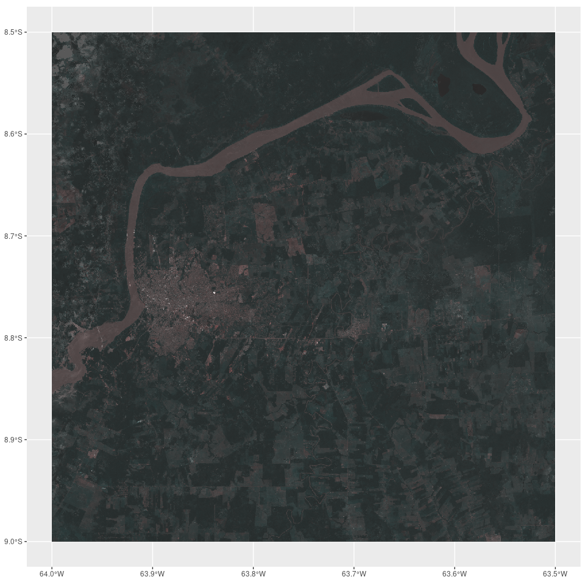

<!-- README.md is generated from README.Rmd. Please edit that file -->

# tacky

<!-- badges: start -->
<!-- badges: end -->

The goal of tacky is to illustrate workflows of satellite image
processing in R using {gdalraster}, {dplyr}, and {targets}. These
workflows are comparable to similar ones in using Opendatacube and
xarray in Python, or with {gdalcubes}, {sits}, {rsi} in R.

This is experimental atm, working side-by-side with the
[{geotargets}](https://github.com/njtierney/geotargets) project to
convert existing alternative spatial workflows into the very efficient
and scaleable check-pointing frameworks of the targetsverse in R.

## Installation

You can obtain the development version of tacky from
[GitHub:mdsumner/tacky](https://github.com/mdsumner/tacky.git).

This is not an actual R package, it’s just a repo to house this
illustration for now.

## Example

This example loads Sentinel imagery from ‘sentinel-2-c1-l2a’ and plots
it:

``` r
library(targets)
tar_make()
#> ✔ skipped target ex
#> ✔ skipped target srcs
#> ✔ skipped target irow
#> ✔ skipped target spec0
#> ✔ skipped target blue
#> ✔ skipped target cloud
#> ✔ skipped target green
#> ✔ skipped target path
#> ✔ skipped target red
#> ✔ skipped target nn
#> ✔ skipped target ref
#> ✔ skipped target spec
#> ✔ skipped branch files_e83624c9
#> ✔ skipped branch files_98e72b41
#> ✔ skipped branch files_c1722a93
#> ✔ skipped branch files_ce606256
#> ✔ skipped branch files_c7b85317
#> ✔ skipped branch files_2f842cc2
#> ✔ skipped branch files_4d0f2439
#> ✔ skipped branch files_eef23bde
#> ✔ skipped branch files_176de522
#> ✔ skipped branch files_2e1cf219
#> ✔ skipped branch files_c55ece38
#> ✔ skipped branch files_c86c0dfe
#> ✔ skipped branch files_45d81544
#> ✔ skipped branch files_eeb81f73
#> ✔ skipped branch files_d6abeb67
#> ✔ skipped branch files_4ac6f72d
#> ✔ skipped branch files_c08ef5b8
#> ✔ skipped branch files_a7812266
#> ✔ skipped branch files_7dd10942
#> ✔ skipped branch files_e8787d74
#> ✔ skipped branch files_01b06abe
#> ✔ skipped branch files_e8bb9e4c
#> ✔ skipped branch files_036ff46b
#> ✔ skipped branch files_bbe406e8
#> ✔ skipped branch files_f3591712
#> ✔ skipped branch files_82628e36
#> ✔ skipped pattern files
#> ✔ skipped target masked
#> ✔ skipped target scaled
#> ✔ skipped target figure
#> ✔ skipped pipeline [0.284 seconds]

tar_read(figure)
```



A comparable pair of workflows in Python is illustrated here:

<https://discourse.pangeo.io/t/comparing-odc-stac-load-and-stackstac-for-raster-composite-workflow/>

We hope to expand the example here into a few more analogous workflows
(at the very least with gdalcbues), and maybe build some helpers.

## Notes

This developed slowly from experiments:

<https://gist.github.com/mdsumner/9b3b4bec40cf7f121db3337a823b413c>

## Code of Conduct

Please note that the tacky project is released with a [Contributor Code
of
Conduct](https://contributor-covenant.org/version/2/1/CODE_OF_CONDUCT.html).
By contributing to this project, you agree to abide by its terms.
